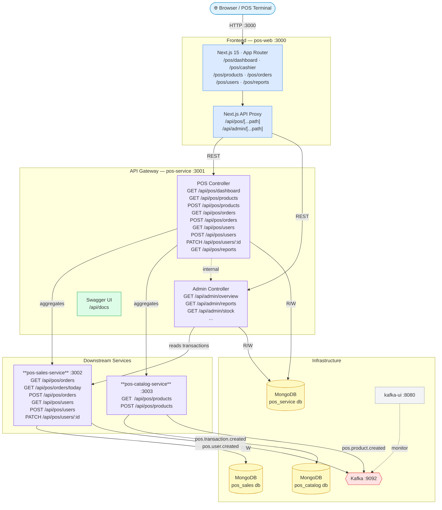

# Smartstore — System Architecture



## Packages

| Package | Port | Technology | Docs |
| ------- | ---- | ---------- | ---- |
| `@pos/pos-web` | 3000 | Next.js 15 · App Router | — |
| `@pos/pos-service` | 3001 | NestJS | [Swagger UI](http://localhost:3001/api/docs) |
| `@pos/pos-sales-service` | 3002 | NestJS | — |
| `@pos/pos-catalog-service` | 3003 | NestJS | — |
| MongoDB | 27017 | MongoDB 7 | — |
| Kafka | 9092 | Confluent Kafka 7.6 | — |
| kafka-ui | 8080 | Provectus Kafka UI | [UI](http://localhost:8080) |
| Zookeeper | 2181 | Confluent Zookeeper | — |

## API Endpoints (pos-service)

All endpoints are prefixed `/api`. The Next.js frontend proxies browser calls through `/api/pos/*` and `/api/admin/*` to the pos-service.

### POS (`/api/pos`)

| Method | Path | Description |
| ------ | ---- | ----------- |
| GET | `/pos/dashboard` | Today's KPIs and top cashiers |
| GET | `/pos/products` | All products with categories |
| POST | `/pos/products` | Create a new product in catalog |
| GET | `/pos/orders` | All POS transactions with summary |
| POST | `/pos/orders` | Checkout — create a transaction |
| GET | `/pos/users` | All POS users (cashiers / managers) |
| POST | `/pos/users` | Create a new POS user |
| PATCH | `/pos/users/:id` | Update user status, role, or shift |
| GET | `/pos/reports` | 7-day sales report |

### Admin (`/api/admin`)

| Method | Path | Description |
| ------ | ---- | ----------- |
| GET | `/admin/overview` | Stock and sales overview |
| GET | `/admin/stock` | Stock levels with reorder alerts |
| GET | `/admin/purchase-orders` | Purchase order list |
| PATCH | `/admin/purchase-orders/:po/approve` | Approve a purchase order |
| GET | `/admin/orders` | Fulfillment order list |
| PATCH | `/admin/orders/:orderNumber/advance` | Advance order status |
| GET | `/admin/catalog` | Admin catalog view |
| GET | `/admin/reports` | Reports (same data as `/pos/reports`) |

## Kafka Topics

| Topic | Published by | Description |
| ----- | ------------ | ----------- |
| `pos.transaction.created` | pos-sales-service | New checkout completed |
| `pos.user.created` | pos-sales-service | New POS user added |
| `pos.product.created` | pos-catalog-service | New product added to catalog |

## Request Flow — Checkout

```text
Browser
  → POST /api/pos/orders        (Next.js proxy)
  → POST /api/pos/orders        (pos-service PosController)
  → POST /api/pos/orders        (pos-sales-service TransactionsController)
  → MongoDB (save transaction)
  → Kafka: pos.transaction.created
```

## Request Flow — Reports

```text
pos-web (server-side SSR)
  → GET /pos/reports            (pos-service PosController)
  → AdminService.getReports()
    ├── GET /api/pos/orders     (pos-sales-service — real transaction data)
    └── AdminRepository.getStockItems() (pos-service MongoDB)
```
