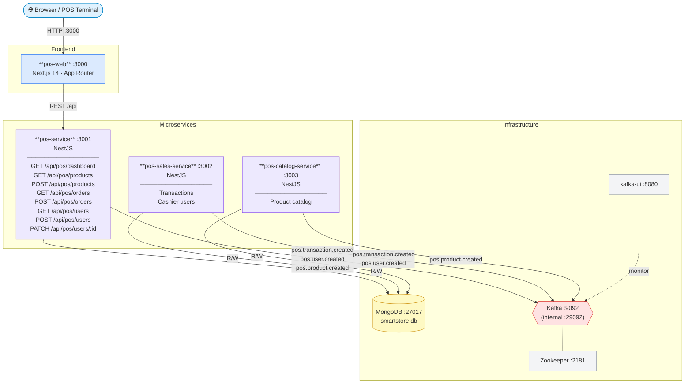

# Smartstore — System Architecture

## Packages

| Package | Port | Technology |
| ------- | ---- | ---------- |
| `@pos/pos-web` | 3000 | Next.js 14 |
| `@pos/pos-service` | 3001 | NestJS |
| `@pos/pos-sales-service` | 3002 | NestJS |
| `@pos/pos-catalog-service` | 3003 | NestJS |
| MongoDB | 27017 | MongoDB 7 |
| Kafka | 9092 | Confluent Kafka 7.6 |
| kafka-ui | 8080 | Provectus Kafka UI |
| Zookeeper | 2181 | Confluent Zookeeper |

## Kafka Topics

| Topic | Publishers |
| ----- | ---------- |
| `pos.transaction.created` | pos-service, pos-sales-service |
| `pos.user.created` | pos-service, pos-sales-service |
| `pos.product.created` | pos-service, pos-catalog-service |
